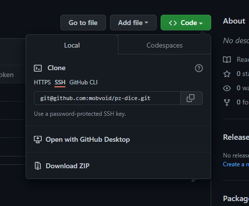
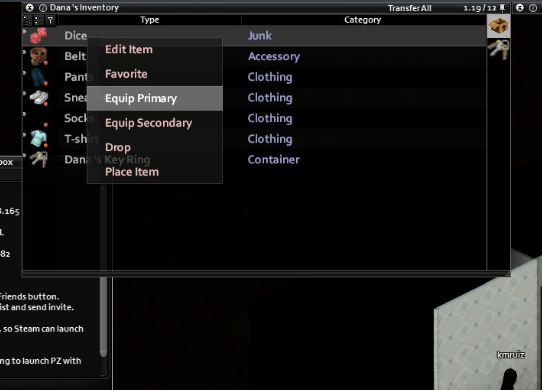
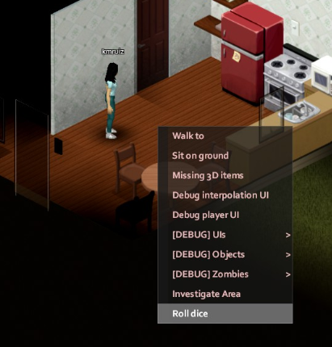

# Project Zomboid Dice Game

## How to install the mod

### With git
With git is the recommended way, as you can just pull the latest changes easily
and don't bother yourself downloading zips. To do so, open a powershell terminal and:

### Navigate to your mods folder: 
```ps1 
$> cd C:\Users\$env:UserName\Zomboid\mods
```

### Do a git clone:
```ps1 
$> git clone git@github.com:mobvoid/pz-dice.git
```

### Without git
### Download a .zip file of the repository.

### Extract the .zip file into the mod folder. Usually it will be located at C:\Users\your-user\Zomboid\mods
### Enjoy!


## How to use in-game

### Find a dice and equip it as your primary equipment.


### Right-click on an empty tile and choose Roll dice


### The dice will end in the floor and your character will say the number it rolled to.